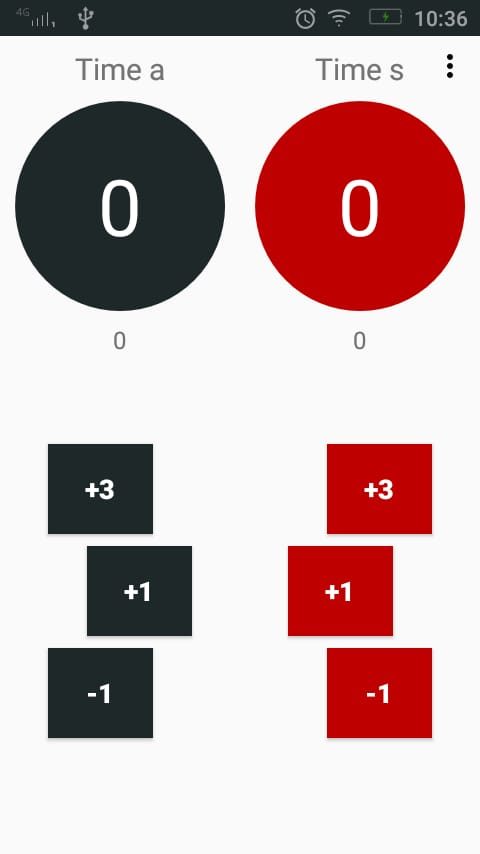

#Run
Talvez você queira gerar a apk desse app e o Android Studio de erro.
Nesse caso atualize app/build.gradle, certifique que eles tem a mesma versão e de preferência para a última
```txt
compileSdkVersion 28
implementation 'com.android.support:appcompat-v7:28.0.0'
targetSdkVersion 28
```

#DONE
- tirar estilo duplicados
- add logo
- adicionar botão de config
- logica dos pontos
- avisar quando esta de onze (dialogo)
- falar quem ganhou (dialogo)
- zerar pontos (dialogo)
- app nao pode ser rotacionado
- tela não apaga
- limitar tamanho dos nomes das equipes (9 caracteres)
- melhorar a logo
- na edicao do nome mostrar quantos caracteres pode digitar
- adicionar lifecycle
- melhorar codigo
- internacionalização (en, pt, es)
- liberar a edição do nome quando clicar em cima do nome
- deixar botão mais claro quando é clicado (holo color)


#NOTA   
app suporta apenas truco paulista


## screenshot

